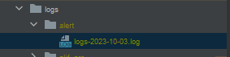
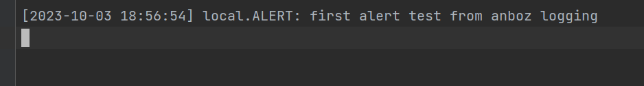

## custom logging

**installing**

````
composer require anboz/custom-logger
````


# Use

````
add channel to 
config/logging.php
[
    'channels' => [ 
        //... 
        'custom-log' => [
            'driver' => 'custom',
            'via' => \Anboz\CustomLogger\Logging\LoggerFactory::class,
            'logger_name' => 'logs',
            'level' => 'debug',
            'ignore_exceptions' => false,
        ],       
        //...
    ]
]
````

````

\Log::alert('first alert test from anboz logging');
````
````
//result
````

````
_
````
